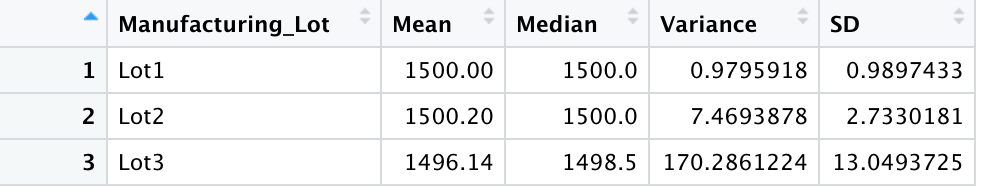

# MechaCar_Statistical_Analysis

## Linear Regression to Predict MPG

The variables that provided a non-random amount of variance to the mpg values in the dataset were:
    - ground clearance at 5.77 -08
    - mpg at 2.60 -12
    - Intercept at 2 -16

The slope of the linear model is not considered to be zero.  Since our p-value of 6.712 X 10-11 is much smaller than our assumed significance level of .05% it is safe to reject the null hypothesis.  As such the slope of the model is not zero.

The linear model does not predict mpg of MechaCar prototypes effectively.  The intercept of 2 X 10-16 is statistically significant which means the significant features (mpg and ground clearance) may need scaling or transformin to help improve the predictive power of the model.  In addition there may be other variables, that are not in this model, that may add predictive value if included in the model.

## Summary Statistic on Suspension Coils
The design specifications for the MechaCar suspension coils dictate that the variance of the suspension coils must not exceed 100 pounds per square inch. Overall the manufacturing data does meet this design specification as seen in the variance of 62.69.

However, when you look at each lot individually, you will see that lot 3 does not meet the design specifications with a variance greater than 100 at 170.

## T-Tests on Suspension Coils
Our final test on the data was to run a `t.test` on the total population and the three lots to confirm that the PSI meets the mean of 1,500. The data was evenly distributed as such I did not use the log 10 method.   From the t.test we can see that the true mean of the sample is 1498.78, which is also illustrated in the above summary table. With a p-Value of 0.06, which is higher than the common significance level of 0.05, there is not enough evidence to support rejecting the null hypothesis, the mean of the total data is statistically similar to the presumed population mean of 1500.

When reviewing the individual lots you will see that Lot1 and Lot2 have higher p-values then our significance level of .05 as such we will not reject the null hypothesis.  However, with Lot3 we will see that the p-value of .04 is less than the significance level of .05 as such there is sufficient evidence that our null hypothesis is not true as such we would reject the null hypothesis for Lot3.  As such, Lot3's PSI is statistically different than the population PSI.

## Study Design: MechaCar vs Competition

When comparing the MechaCar to its competition some key metrics that should be considered include:
    Cost to manufacture
    Selling price
    Fuel Efficiency
    Safety Rating
    Quantity Sold

After going thru these measures we should be able to successfully test the following hypothesis

    Null Hypothesis - The MechaCar is comparable to other cars in the marketplace
    Alternative Hypothesis - The MechaCar is not comparable to other cars in the marketplace

To test this hypothesis I would recommend using a multiple linear regression model to determine the variables that have the highest correlation or predictability on the competitiveness of the MechaCar.  
